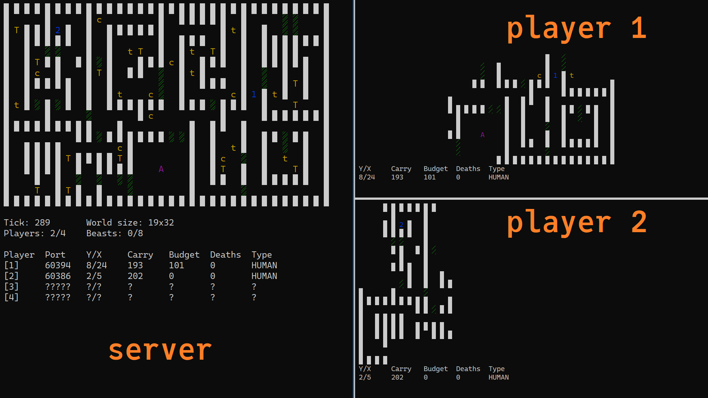

# TUI Multiplayer Game

A multiplayer terminal game written in C using threads and sockets.



## Gameplay
The main objective of the game is to collect as many coins as possible and save them by going to the campsite. Other players may kill which will leave all your money behind and let others sweep it. There are also wild beasts, which hunt for players.

## Architecture
The game consists of:
- [Server](server.c) - Handles the game logic and connects all players together
- [Client](client.c) - A game client operated by a human player
- [Bot Client](bot-client.c) - Game client that plays autonomously using a very simple threat detection algorithm
- [Beast Client](beast-manager.c) - A server-side client that hunts for players and can be added on the server side

All the clients operate on the same API, which means that even the server-side beast clients don't get any advantage. Everyone reveives a 5 by 5 area around them and keeps track of any terrain discovered since joining the game.

Clients connect to the server using a websocket and communicate with a simple API which sends serialized map data to them. Bot clients are started as children of the server process, as they can't be run separately.

The server tries to handle every client's request asynchronously in separate threads. Keyboard handlers are also separate from the game loop and connection thread.

## Building
Generate build files:
```
cmake -B .
```
Then build binaries:
```
cmake --build .
```

## Running
You need to start the game server before any clients can connect. Up to 4 clients (including bot clients) can join the game session. New beasts are added by pressing `b` in the server window. Up to 8 beasts can be added. A client or server window can be closed by pressing `q`.

## Configuration
You can change the server's address and port in `config.h`. The map can also be changed, but needs to be in the `ppm` format. GIMP can be used to draw the included map files (which are exported as ASCII and stripped from the "Created by GIMP version ..." comment in line 2).

The supported objects in maps are:
- `#ffffff` - empty tile
- `#000000` - wall
- `#00ff00` - bush
- `#ff00ff` - campsite

## Compatibility
This project was written and only tested on Linux. Movement controls in clients may not work on other terminals, as it uses the non-canonical immediate input mode. Keep in mind that it's known to work on Konsole and Ubuntu Terminal, other terminals may malfunction. If you ever run into rendering issues, use the `reset` command in your shell to fix the terminal output.

Support for threading and sockets should also be noted, as the libraries used are platform-dependent and this code will not work under other platforms.
